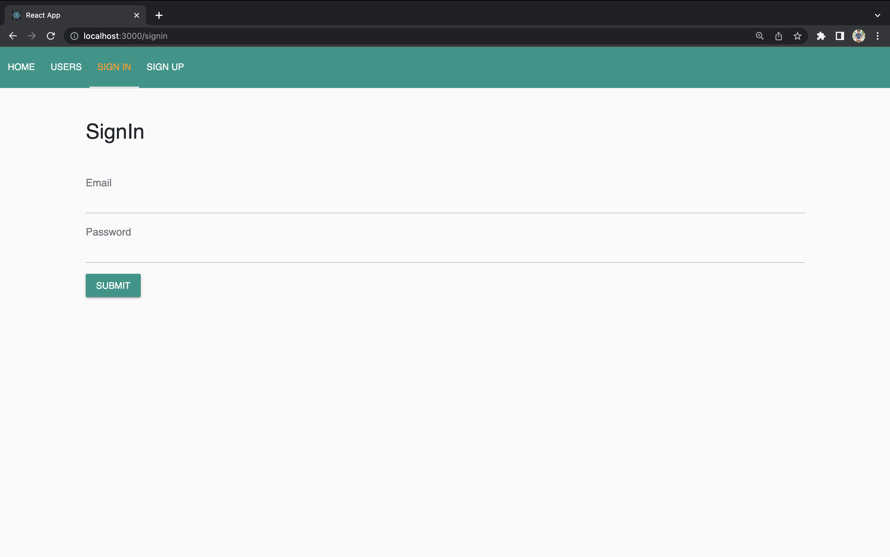
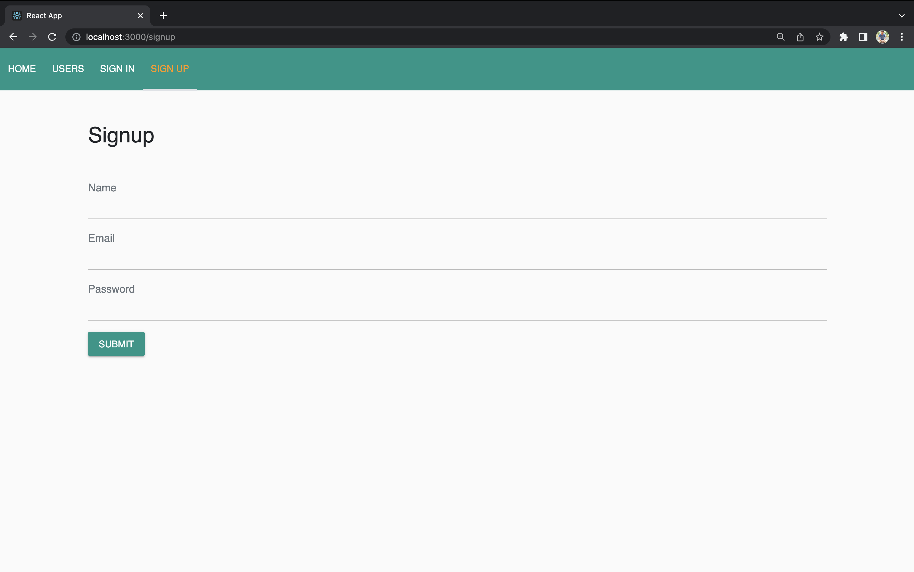

# Instagram Clone Application

## System Architecture
 
* Client: React.js with Redux
* Backend: Node.js, MongoDB 

## Object Management Policy

When a request is made from the client, the request is processed by the API gateway, and the request, along with its parameters like path params, query params and body params are extracted and forwarded to Node JS. Once the request task is accomplished, the response is sent to client. 

## Handling heavyweight resources

*	The server's load was distributed and handled via load balancing to multiple instances of our application.

## Contributing 💡

#### Step 1

- **Option 1**

  - 🍴 Fork this repo!

- **Option 2**
  - 👯 Clone this repo to your local machine.

#### Step 2

- **Build your code** 🔨🔨🔨

#### Step 3

- 🔃 Create a new pull request.

## License

- **[MIT license](http://opensource.org/licenses/mit-license.php)**

## Screenshots of the App

